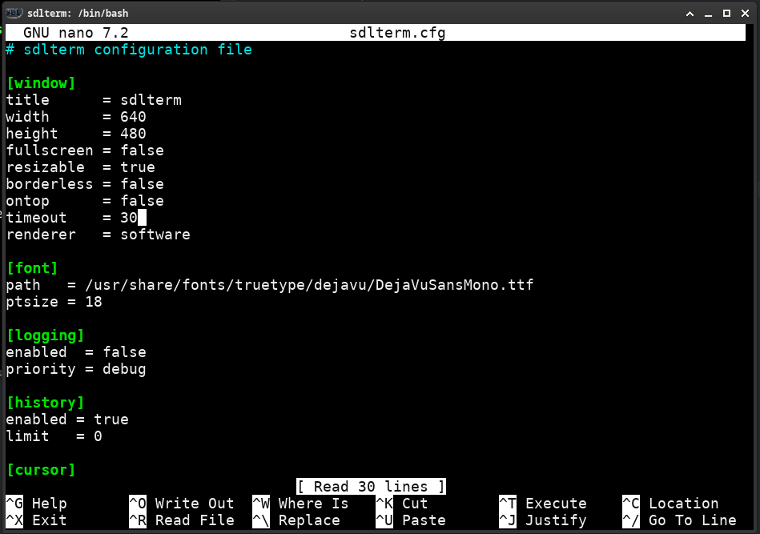

# sdlterm

 

### About

SDL2 Terminal Emulator based on [libsdl2](http://www.libsdl.org), [libvterm](http://www.leonerd.org.uk/code/libvterm/) and [SDL_fox](https://github.com/palomena/SDL_fox).  
Should be compatible with all POSIX compliant systems and probably also win32.



Originally developed as a standalone terminal emulator, meaning all of the
vt100 and xterm behind the scenes management had been implemented from scratch.
Turned out ok-ish, but a few edge cases kept failing. Did not want to
go through 3000+ loc of cryptic csi sequence parsing and vt100 handling. 
Heard of libvterm and never looked back since. Don't reimplement the wheel.

Single source file, less than 1000 loc, kept as simple and minimal as possible.


### Features
- Clipboard handling (Copy+Paste)
- Visual terminal bell
- Blinking cursor
- Colors
- Font zoom on mousewheel/touchpad event
- Runtime selectable renderer backend (software, opengl, etc)
- window resize triggers buffer and child process resize
- Fast, due to SDL_fox prerendered font rendering
- Easily hackable by playing around with the accessible sourcecode
- Probably runs on a posix compliant toaster (if SDL supports it)

### Missing features / Future improvements
- Scrollback buffer
- Performance
	- damage triggers full screen redraw, where partial update would be sufficient

### Build

1. Install libsdl2, libsdlfox, make
2. `git clone [REPOSITORY URL]`
3. cd ./sdlterm
4. `make`
5. A *wild* sdlterm application should appear in the ./build directory

### License

```
MIT License

Permission is hereby granted, free of charge, to any person obtaining a
copy of this software and associated documentation files (the "Software"),
to deal in the Software without restriction, including without limitation
the rights to use, copy, modify, merge, publish, distribute, sublicense,
and/or sell copies of the Software, and to permit persons to whom the
Software is furnished to do so, subject to the following conditions:

The above copyright notice and this permission notice shall be included in
all copies or substantial portions of the Software.

THE SOFTWARE IS PROVIDED "AS IS", WITHOUT WARRANTY OF ANY KIND, EXPRESS
OR IMPLIED, INCLUDING BUT NOT LIMITED TO THE WARRANTIES OF MERCHANTABILITY,
FITNESS FOR A PARTICULAR PURPOSE AND NONINFRINGEMENT. IN NO EVENT SHALL THE
AUTHORS OR COPYRIGHT HOLDERS BE LIABLE FOR ANY CLAIM, DAMAGES OR OTHER
LIABILITY, WHETHER IN AN ACTION OF CONTRACT, TORT OR OTHERWISE, ARISING
FROM, OUT OF OR IN CONNECTION WITH THE SOFTWARE OR THE USE OR OTHER
DEALINGS IN THE SOFTWARE.
```